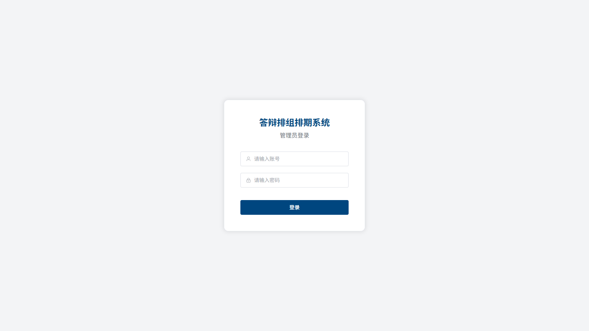
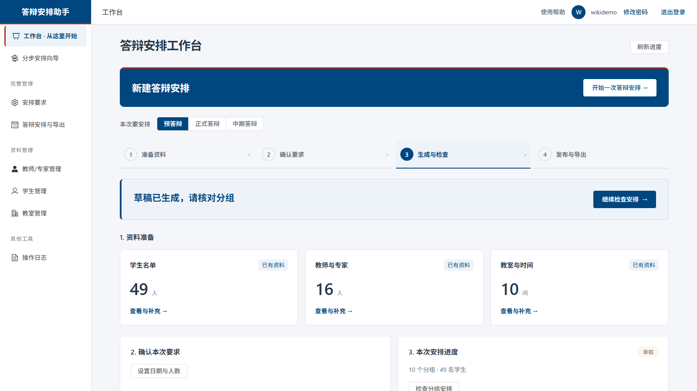
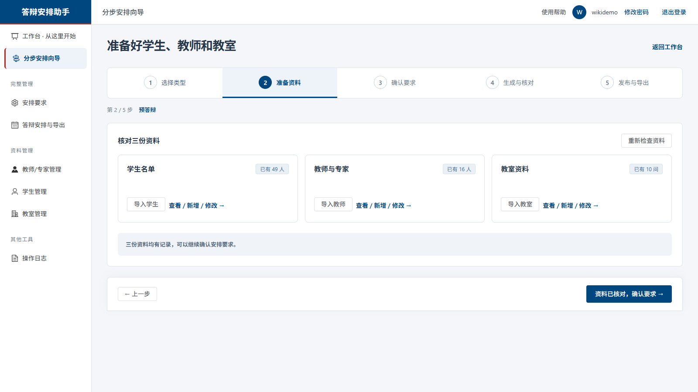
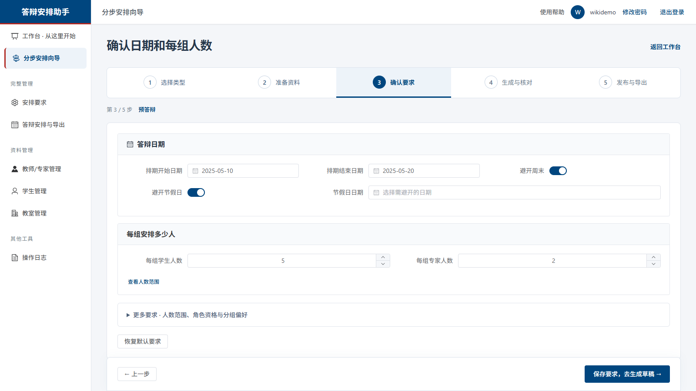
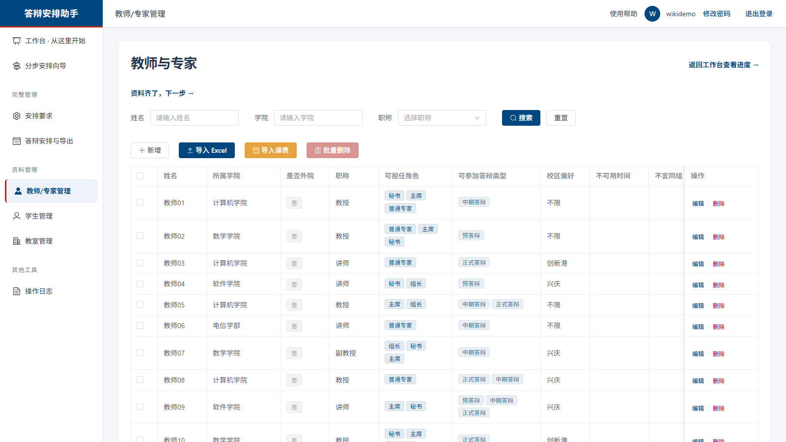
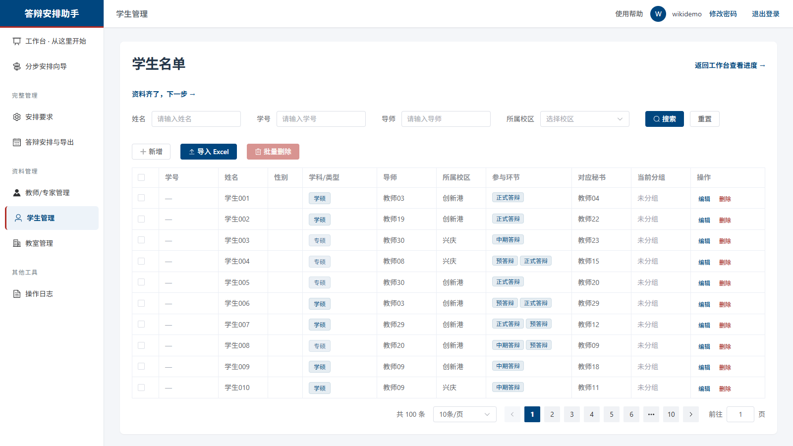
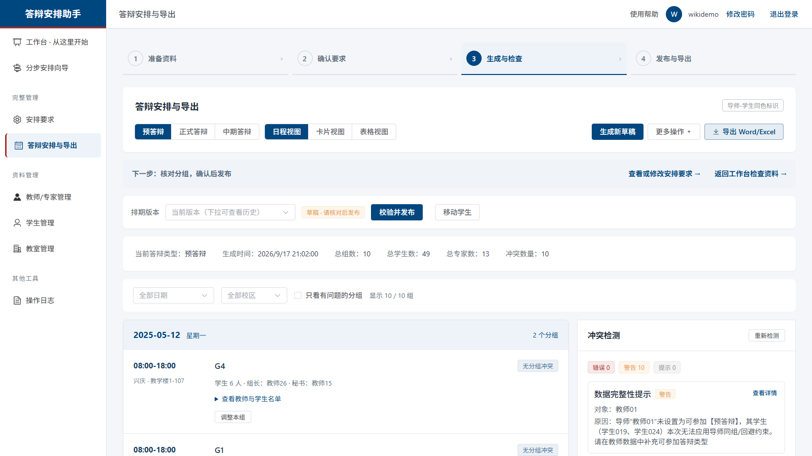
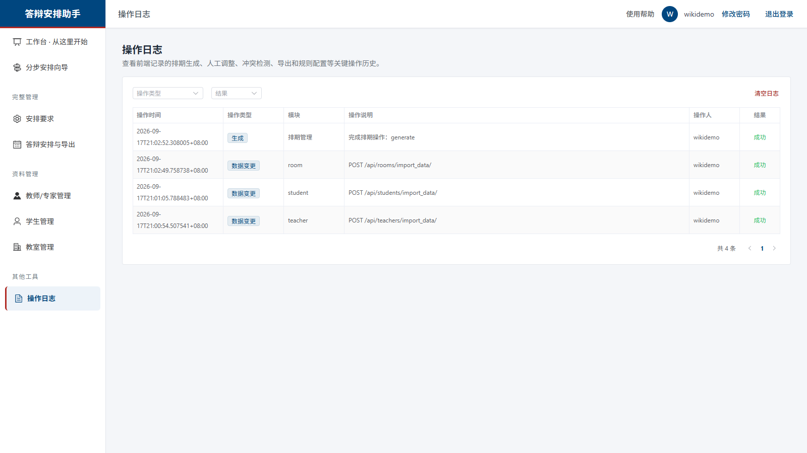

# 智能答辩分组编排系统 · WIKI

> 基于 **Vue 3 + TypeScript + Element Plus**（前端）与 **Django 6 + Django REST Framework + SQLite**（后端）的研究生答辩分组排期系统（现名"答辩安排助手"）。
> 支持五步向导式排期、基础数据管理、Excel 批量导入、规则配置、自动排期、日程视图、冲突检测、人工调整、Excel/Word 导出与操作审计。

---

## 目录

1. [实现的功能](#1-实现的功能)
2. [安装与配置说明](#2-安装与配置说明)
3. [快速开始（python main.py）](#3-快速开始)
4. [输入格式](#4-输入格式)
5. [输出格式](#5-输出格式)
6. [运行截图](#6-运行截图)
7. [API 接口概览](#7-api-接口概览)
8. [测试与质量保障](#8-测试与质量保障)

---

## 1. 实现的功能

### 1.0 五步向导与工作台（2026-09 易用性升级）

- **工作台**：根据真实资料和当前排期提示下一步操作；顶部"开始一次答辩安排"直达向导；资料卡片展示学生/教师/教室数量；失败状态明确提示而非显示为"无资料"。
- **五步向导**（`/schedule-wizard`）：选择类型 → 准备资料 → 确认要求 → 生成与核对 → 发布与导出。
  - 缺资料时阻止继续，提供导入入口；常用规则直接展示，高级规则按需展开；
  - 返回上一步保留未保存内容，离开向导/切换类型前提示；刷新后按 URL 恢复步骤；
  - 第四步分组核对、第五步发布；草稿导出、历史版本、移动学生等原有能力保留。
- **日程视图**：按日期和时段展示分组，可展开名单、调整本组、查看问题；日期/校区/问题筛选同时作用于日程、卡片、表格三种视图；全局冲突仍在冲突面板展示。
- 右上角"使用帮助"与《教师快速上手》文档（见 [开发文档/教师快速上手.md](开发文档/教师快速上手.md)、[开发文档/分步向导与日程视图说明.md](开发文档/分步向导与日程视图说明.md)）。

### 1.1 基础数据管理

| 模块 | 功能 |
| --- | --- |
| 教师管理 | 增删改查、批量导入、批量删除；字段含学院、职称（教授/副教授/讲师/其他）、可担任角色（主席/秘书/普通专家）、校内校外、可参与答辩类型、校区偏好、不可用时间、回避教师 |
| 学生管理 | 增删改查、批量导入、批量删除；字段含学号、学生类型（学硕/专硕/博士）、导师、校区、答辩类型、指定秘书 |
| 教室管理 | 增删改查、批量导入；字段含校区、教室名、容量、可用时间 |
| 课表导入 | 支持按"卡片式"课表文本/文件导入教师不可用时间（`import_timetable`） |

### 1.2 规则配置

每种答辩类型（预答辩 / 正式答辩 / 中期答辩）独立配置：

- 排期日期区间、避开周末、避开节假日、指定排除日期；
- 每组学生数（目标/下限/上限）、专家数（目标/下限）、秘书数；
- 角色资格约束（主席/组长/秘书最低职称要求、高职称优先）；
- 导师回避（导师不参与自己学生的答辩组）；
- 软约束权重滑杆：组间人数均衡、高职称优先、避免跨校区、校外导师集中度、学硕优先。

### 1.3 自动排期

- 调用 `algorithm.py` 求解器，按规则把学生分到答辩组，并分配时间、教室、主席、秘书与专家；
- 生成请求去重 + 数据库写锁（`ScheduleWriteLock`）防止并发重复生成；
- 支持多版本（`ScheduleVersion`）：草稿校验 → 发布（publish）→ 历史快照可回溯。

### 1.4 人工调整与冲突检测

- 调整操作：学生换组、更换专家、更换主席、更换秘书、调整时间、调整教室；
- 每次调整后自动触发冲突检测（导师回避冲突、专家重复、时间冲突、容量超限等），结果以冲突面板/标签展示；
- 乐观锁/版本 revision 校验，防止并发编辑互相覆盖。

### 1.5 导出

- **Excel 导出**：每组一个工作表，含时间/教室/校区/主席/秘书/专家与学生名单，导师-学生同名同色（字体着色，仅姓名列着色，类型/职称列保持黑色）；
- **Word 导出**：生成答辩排期表 docx 文档（`export_word.py`，python-docx 实现），除导师与学生姓名外一律黑色。

### 1.6 安全与审计

- Django 认证：登录 / 登出 / 修改密码，前后端会话打通；
- 服务端审计：关键操作写入 `OperationLog`（类型、模块、描述、操作人、结果、明细），支持查询与清空；
- 生产加固：`DEBUG` 默认关闭、CORS 白名单、密钥本地化（`app-data/secret.key`）、SQLite 自动备份（迁移前 `backup_sqlite`）。

---

## 2. 安装与配置说明

### 2.1 环境要求

| 依赖 | 版本 |
| --- | --- |
| Python | 3.12+ |
| Node.js（仅前端开发/构建） | 18+ |
| npm | 9+ |

### 2.2 安装依赖

所有 Python 依赖已在 `requirements.txt` 中声明：

```bash
python -m venv .venv
.\.venv\Scripts\activate          # Windows
pip install -r requirements.txt
```

`requirements.txt` 内容概览：

| 包 | 用途 |
| --- | --- |
| Django==6.0.4 | Web 框架 |
| djangorestframework==3.17.1 | REST API |
| django-cors-headers==4.9.0 | 跨域控制 |
| openpyxl==3.1.5 | Excel 导入/导出 |
| pandas==2.2.1 + xlrd==2.0.2 | 导入文件解析（含 .xls 课表） |
| python-docx==1.2.0 | Word 导出 |
| waitress==3.0.2 | 生产级 WSGI 服务（main.py 使用） |
| asgiref / sqlparse / tzdata / et_xmlfile | Django/Excel 间接依赖 |

另有可选依赖文件：

- `requirements-dev.txt`：验证工具（playwright，用于 `WIKI/scripts/` 下的截图与回归脚本），运行应用本身不需要；
- `requirements-production.txt`：生产部署依赖。

前端依赖由 `package.json` 管理：`npm install`。

### 2.3 配置项（环境变量）

| 变量 | 默认 | 说明 |
| --- | --- | --- |
| `DEFENSE_SCHEDULER_PORT` | `8000` | 监听端口 |
| `DEFENSE_SCHEDULER_HOST` | `127.0.0.1` | 监听地址 |
| `DEFENSE_SCHEDULER_OPEN_BROWSER` | `true` | 启动后自动打开浏览器 |
| `DJANGO_DB_PATH` | `app-data/db.sqlite3` | SQLite 数据库路径 |
| `DJANGO_DEBUG` | `false` | 调试模式（生产保持关闭） |
| `DJANGO_SECRET_KEY` | 自动生成并写入 `app-data/secret.key` | Django 密钥 |
| `DJANGO_ALLOWED_HOSTS` | `localhost,127.0.0.1` | 允许的主机 |
| `DJANGO_CORS_ALLOWED_ORIGINS` | — | CORS 白名单 |
| `FRONTEND_DIST_DIR` | `dist/` | 前端静态产物目录 |

### 2.4 桌面单文件版（可选）

```powershell
.\scripts\build-exe.ps1        # 生成 release\DefenseScheduler.exe
.\release\DefenseScheduler.exe
```

首次启动自动生成 `release\app-data\INITIAL_ADMIN.txt`（初始管理员账号密码）。

---

## 3. 快速开始

**一条命令启动（推荐）：**

```bash
pip install -r requirements.txt
python main.py
```

`main.py` 会自动完成：

1. 初始化运行时配置（数据目录 `app-data/`、密钥）；
2. 执行数据库迁移（SQLite，迁移前自动备份旧库）；
3. 首次运行自动创建管理员，账号密码写入 `app-data/INITIAL_ADMIN.txt`；
4. 用 waitress 启动服务并打开浏览器 → `http://127.0.0.1:8000`。

> 也可使用开发模式：后端 `python manage.py runserver`，前端 `npm run dev`（Vite，代理 `/api` 到 8000 端口）。

**首次登录后请立即修改管理员密码。**

---

## 4. 输入格式

### 4.1 教师导入模板（.xlsx，首个工作表）

| name | college | isExternal | title | roles | availableTypes | campusPreference | unavailableTimes | avoidTeacherNames | remark |
| --- | --- | --- | --- | --- | --- | --- | --- | --- | --- |
| 教师01 | 计算机学院 | FALSE | 教授 | 秘书,主席,普通专家 | 中期答辩 | 不限 | 周三全天 |  |  |

- `isExternal`：TRUE/FALSE（校外专家）；
- `roles`：逗号分隔，可选 主席 / 秘书 / 普通专家 / 组长；
- `unavailableTimes`：支持"周三全天 / 周一 1-2 节 / 2026-03-05 上午"等自然语言时间文本。

### 4.2 学生导入模板

| name | studentType | mentorName | campus | defenseTypes | secretaryName | remark |
| --- | --- | --- | --- | --- | --- | --- |
| 学生001 | 学硕 | 教师03 | 创新港 | 正式答辩 | 教师04 |  |

- `studentType`：学硕 / 专硕 / 博士；
- `mentorName` 必须与教师姓名一致（用于导师回避与同色导出）。

### 4.3 教室导入模板

| campus | name | capacity | availableTimes | remark |
| --- | --- | --- | --- | --- |
| 创新港 | 教学楼5-101 | 60 | 周一至周五全天 |  |

### 4.4 课表导入

支持上传教师课表（.xlsx/.xls）或粘贴卡片式课表文本，系统自动解析为教师 `unavailableTimes`，导入前提供预览与告警（`ImportPreviewDialog`，未识别时间条目会逐条警告）。

> 项目根目录提供现成示例：`批量测试_教师_30人.xlsx`、`批量测试_学生_100人.xlsx`、`批量测试_教室_10间.xlsx`，可直接用于导入演练。

---

## 5. 输出格式

### 5.1 Excel 排期表（`GET /api/schedule/export-excel/?defense_type=中期答辩`）

- 每个答辩组一个工作表（Sheet 名 `组1`、`组2`…）；
- 表头区：时间、教室、校区、主席/组长、秘书、专家名单；
- 学生表格列：**学生姓名 | 学生类型 | 导师姓名 | 导师职称**；
- 着色规则：同一导师及其学生在全表中同色显示（字体着色），便于人工核对回避约束；
  仅 **学生姓名** 与 **导师姓名** 两列着色，学生类型、导师职称两列一律黑色。

### 5.2 Word 排期表（`GET /api/schedule/export_word/`）

python-docx 生成的正式排版文档，按组分节列出时间、地点、专家组成员与学生名单。

结构标签（组号、时间、地点、组长|主席、专家、秘书、学生）与时间值一律黑色，只有导师与学生姓名着色——师生配对是全表唯一靠颜色承载的信息（正式答辩导师回避时用于人工核对）。

### 5.3 配色数据源（前后端共用）

`shared/mentor-colors.json` 是导师配色的**唯一数据源**：

- 色板 16 槽位，每槽一对 `{ light, dark }`：`light` 供网页标签底色（浅底深字），`dark` 供 Word/Excel 导出字体着色（白底深字）；
- 槽位统一由 `index = jsHash(导师姓名) % 16` 决定，前端 `src/utils/color.ts` 与后端 `api/mentor_colors.py` 共用同一公式，同一导师在网页与导出中恒定同色；
- JSON 内置 `hashVectors` 黄金向量，两端各自校验：前端在模块加载时自检并在控制台报错，后端由 `MentorColorSourceTests` 覆盖。任一端算法漂移会立刻暴露；
- 改配色只需改这一个 JSON，前后端代码都不用动。

### 5.4 排期结果（前端 JSON，`GET /api/schedule/current/`）

```jsonc
{
  "version": 3,
  "status": "published",          // draft / published
  "groups": [
    {
      "group_id": "组1",
      "time": "2026-03-05 08:30-12:00",
      "room": { "name": "教学楼5-101", "campus": "创新港" },
      "chair": "教师01",
      "secretary": "教师04",
      "experts": ["教师02", "教师07"],
      "students": [ { "name": "学生001", "student_type": "学硕", "mentor_name": "教师03" } ]
    }
  ]
}
```

---

## 6. 运行截图

以下截图均为真实运行截图（`python main.py` 启动，浏览器访问 `http://127.0.0.1:8000`，已导入 30 名教师 / 100 名学生 / 10 间教室的批量测试数据，2026-09-19 版界面）：

| 截图 | 说明 |
| --- | --- |
|  | 登录页：Django 认证，首次运行自动生成管理员 |
|  | 工作台：下一步提示、资料卡片（学生/教师/教室数量）、排期进度 |
|  | 五步向导第 2 步：核对三份资料，缺资料时阻止继续并提供导入入口 |
|  | 五步向导第 3 步：日期、每组人数等常用要求直接展示 |
|  | 教师管理：批量导入 30 名教师后的列表 |
|  | 学生管理：批量导入 100 名学生后的列表 |
|  | 排期结果日程视图：按日期/时段分组展示、冲突检测面板、Word/Excel 导出 |
|  | 操作日志：服务端审计记录（导入、生成、调整等） |

> 截图复现脚本：`WIKI/scripts/take_screenshots.py`（需先 `pip install -r requirements-dev.txt` 并 `python -m playwright install chromium`）；提交证据端到端复现：`WIKI/scripts/verify_submission.py`（使用一次性临时数据库，不触碰业务数据）。

---

## 7. API 接口概览

统一前缀 `/api/`，认证方式为 Django Session（登录后 Cookie）。

| 方法与路径 | 说明 |
| --- | --- |
| `POST /api/auth/login/` · `POST /api/auth/logout/` · `POST /api/auth/change-password/` | 认证 |
| `GET/POST/PUT/DELETE /api/teachers/` | 教师管理 |
| `POST /api/teachers/import_data/` | 教师 Excel 批量导入 |
| `POST /api/teachers/batch_delete/` | 教师批量删除 |
| `POST /api/teachers/import_timetable/` | 教师课表导入（不可用时间） |
| `GET/POST/PUT/DELETE /api/students/` | 学生管理（含 `import_data`、`batch_delete`） |
| `GET/POST/PUT/DELETE /api/rooms/` | 教室管理（含 `import_data`） |
| `GET/PUT /api/rule-config/` | 规则配置（按答辩类型） |
| `POST /api/schedule/generate/` | 生成自动排期 |
| `GET /api/schedule/current/` | 当前生效排期 |
| `GET /api/schedule/versions/` · `POST /api/schedule/publish/` | 版本管理与发布 |
| `POST /api/schedule/adjust/` · `POST /api/schedule/adjust-group/` | 人工调整（换组/换专家/换主席/换秘书/改时间/改教室） |
| `POST /api/schedule/check-conflicts/` | 冲突检测 |
| `GET /api/schedule/export-excel/` · `GET /api/schedule/export_word/` | 导出 |
| `GET/POST/DELETE /api/operation-logs/` | 操作日志（查询/上报/清空） |

---

## 8. 测试与质量保障

```bash
npm run check        # 前端类型检查
npm run lint         # 前端代码规范
python manage.py test  # 后端单元/集成测试（认证、导入告警、排期稳定性、并发等）
python manage.py check --deploy   # 生产配置体检

# 浏览器回归（五步向导 UI，使用临时数据库，不影响业务数据）
.venv/Scripts/python scripts/ui-fixture-server.py   # 终端 1：测试夹具服务 127.0.0.1:8769
.venv/Scripts/python scripts/test-wizard-ui.py      # 终端 2：向导流程回归
```

稳定性专项（详见 [开发文档/稳定性升级与运维说明.md](开发文档/稳定性升级与运维说明.md)）：
草稿校验发布、历史快照回溯、并发编辑保护（写锁 + revision）、生成请求去重、服务端审计、数据库自动备份。
