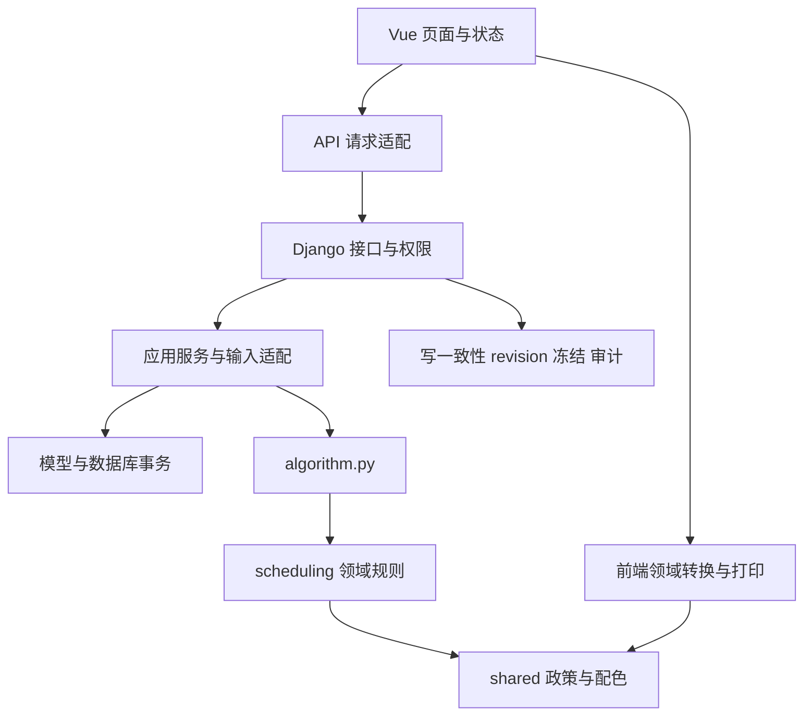

# 架构入口

详细当前实现见 [V2 架构升级说明](架构升级说明.md)，开发边界见 [CONTRIBUTING.md](../../CONTRIBUTING.md)。

新增复杂业务优先放入 `api/services/`；算法领域保持独立于 ORM。当前主求解流程仍主要位于 `algorithm.py`，HTTP 层仍有部分既有编排，细化时按用例小步迁移。

全局写锁与同步生成是现有一致性取舍；吞吐、任务队列和数据库切换需要依据容量测试另作决策。

## 架构决策记录

- [ADR-0001 分层与共享规则](adr/0001-分层与共享规则.md)

新增决策记录包含状态、背景、决定、后果和替代方案；PR 关联相关决定。现有历史文档保留原日期和版本，当前边界改变时同步更新本目录。
