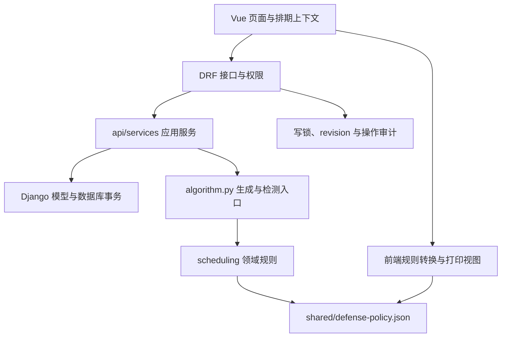

# 智能答辩分组编排系统：V2 架构升级说明

更新日期：2026-10-02。依据 [PRD V1.1](../requirements/答辩排组排期系统_产品需求文档_V1.1.docx) 和 [纯需求精简版](../requirements/答辩排组排期系统_纯需求精简版.docx)，本轮把规则配置、基础数据关系、生成与重验、两阶段沿用、手动调整和导出放到同一套业务边界内。本文描述该版本代码已经实现的行为，并保留尚未实现的范围。2026-10-09 仅调整文档位置与引用，下面的历史验证记录仍对应原版本。

## 1. 模块分层



| 层级 | 主要文件 | 责任 |
| --- | --- | --- |
| 前端领域与上下文 | `src/domain/defense.ts`、`scheduleRules.ts`、`scheduleContext.ts`、`src/composables/useScheduleContext.ts` | 共用答辩类型与政策；统一新旧配置；通过答辩类型、版本、请求序号和 revision 避免过期响应覆盖当前界面。 |
| HTTP 接口 | `api/schedule_views.py`、`api/views.py` | 鉴权、请求/响应、联合生成、发布与冻结、部分手调流程；原排期路由保持兼容。 |
| 应用服务 | `api/services/rules.py`、`scheduling_input.py`、`schedules.py` | 规则归一化、ORM 转算法输入、生成持久化、秘书同步和冲突重验。 |
| 关系与时间服务 | `api/services/reference_data.py`、`time_data.py`、`adjustments.py` | 教师 ID/姓名兼容、安全重命名、共用时间解析、携带关系的学生移动。 |
| 导出 | `api/services/export_excel.py`、`api/export_word.py`、`src/domain/printSchedule.ts` | Excel、Word 与浏览器打印视图，优先读取所选版本的冻结数据。 |
| 排期领域规则 | `scheduling/policies.py`、`scheduling/continuity.py`、`scheduling/preferences.py` | 不依赖 Django 的委员会资格、人数、软件学院底线、继承组号、导师同场校验，以及外院到场日集中和软件评审轮换偏好。 |
| 算法兼容入口 | `algorithm.py` | 保留 `generate_schedule()` 入口，学生分组、候选时段与人员分配仍主要在本文件；本轮抽离了可复用领域规则。 |
| 持久化与一致性 | `api/models.py`、`api/schedule_integrity.py`、`api/audit.py` | 稳定关系、版本、事务写锁、乐观 revision、冻结快照与服务端审计。 |
| 共享政策 | `shared/defense-policy.json`、`shared/mentor-colors.json` | 前后端政策默认与导师配色来源；打包配置收录这些资源及 `scheduling` 模块。 |

## 2. 基础数据使用稳定关系

教师新增 `is_active`、`member_eligible`、`is_software_teacher`，API 对应 `isActive`、`memberEligible`、`isSoftwareTeacher`。存量教师默认启用并具备普通专家资格。软件学院认定使用“显式标记为软件学院导师，或非外院且所属学院包含软件”的兼容判断。

学生新增可空关系 `mentor` 和 `bound_secretary`，API 对应 `mentorId`、`secretaryId`。原有 `mentor_name`、`secretary_name` 保留，用于旧文件导入、未录入教师及历史兼容。读取已关联学生时以教师当前姓名为准；写 ID 时同步姓名，写姓名时匹配已有教师，ID 与姓名同时提交但不一致时拒绝。删除教师后关系置空，兼容姓名保留。

教师重命名在事务内同步可变学生关系及不宜同组名单中的完整姓名词项。已发布或归档排期的 JSON 快照不随基础数据重命名改写。后来补录教师时，可以自动绑定此前同名但未关联的学生。

## 3. 规则版本和业务底线

前端配置使用 `policyVersion: 2`，生成请求经 `buildScheduleRules()` 转成 `policy_version: 2` 等算法字段。规则默认来自共享政策，日期使用 `timezone.localdate()`，默认结束日期为开始日期后 10 天。各类默认如下：

| 答辩类型 | 学生人数默认 | 专家总数，含主席/组长 | 主席/组长最低资格 | 导师关系 |
| --- | --- | --- | --- | --- |
| 预答辩 | 目标 6，范围 4–8 | 至少 4 | 副教授/副高 | 导师在学生所在组 |
| 正式答辩 | 目标 6，范围 4–8 | 固定 5 | 教授/正高 | 默认回避指导学生所在组，同时与自己的学生同场到场 |
| 中期答辩 | 目标 12，范围 10–13 | 至少 5 | 副教授/副高 | 导师在学生所在组 |

每组配 1 名秘书，最低为讲师。主席/组长只占专家总人数中的一个席位；秘书不计入专家人数。正式答辩默认至少 3 位软件学院导师，配置范围为 3–5 人。所有新方案使用课程半天阻塞，避免“上三上四”等课程描述只阻塞部分课程时段后又被安排到同一半天。

中期答辩支持 `campusStartDates`，请求转换为 `campus_start_dates`，可以为创新港和兴庆设置各自最早安排日期。校区日期必须处于本次排期的总日期范围内，各组仍同时满足其所属校区的日期约束。

硬规则包括学生覆盖、时间与教室互斥、不可用时间、资格与停用状态、普通专家资格、不宜同组、人数底线、导师同组/回避及正式答辩导师同场。秘书不得在其指导学生所在组担任秘书。生成、手调和发布复用冲突检测；资源不足可以形成带错误的草稿，发布前重验并阻止仍有 `error` 的版本。

V2 逐个检查已绑定学生的秘书连续性，关系断裂作为 `error` 阻止发布；旧 schema 1 保留原有提示级别。管理员显式更换正式版秘书时仅更新该版本涉及学生的关系基线。

软规则采用人数均衡、正高优先、跨校区偏好、学硕优先、外院导师同天集中及软件学院评审次数轮换等排序或阈值启发式。软件学院补充专家按已参加次数优先轮换，结果可以重复复现，不使用随机抽取；受硬约束限制不能满足集中或均衡目标时提示 `warning`。当前方案质量评分只衡量有数据支持的人数均衡、组长正高及教师出席日跨校区情况；它不是全量加权求解或学生答辩成绩。

旧集成请求若未声明规则版本但直接提供低层 `expert_count`，应用层按 schema/policy 1 保留原有普通专家计数语义；其他新请求默认按 2 校验。新 UI 会归一化到 2，并把旧 0–10 软权重升级为 0–100。旧版本的规则快照保持原样，以便解释生成当时的行为。

## 4. 两阶段沿用固定来源

正式答辩沿用预答辩时保存 `ScheduleVersion.source_pre_version`，并把生成时的学生 `previous_group_id` 与 `secretary_id` 存入自身 `input_snapshot`。读取沿用组号和秘书使用指定预答辩版本，正式版重验也恢复生成时的关系基线。后来生成新的 current 预答辩，不会把已有正式版的来源悄悄替换为新的 current。管理员显式调整正式版秘书时会更新该正式版的关系基线。

正式版学生的秘书显示、冲突校验及导出均以本版本 `input_snapshot` 为准。正式版移动或显式改绑只改变本版本的关系，不写回预答辩的全局学生绑定。完整分组表单提交未变秘书时，不因调整时间、教室或其他字段而重新绑定学生。联合生成的“本轮重选秘书”只在生成阶段执行，后续编辑仍检查已建立的秘书连续性。

联合生成通过同一个数据库事务依次生成预答辩和正式答辩，固定引用刚生成的预答辩，要求正式答辩日期晚于预答辩结束日期，并支持 request key 重复请求返回。任一阶段失败时全部回滚。这是带固定来源的两阶段流程，尚不是同时优化两个阶段的全局求解器。

联合生成创建本轮两份新草稿，预答辩重新分配本轮秘书，正式答辩继承这次预答辩的组号和秘书；页面在生成前明确提示这次重新分配。排期优先让非本轮导师担任秘书，按已分配负载轮换，并在正式答辩为另一组学生的导师预留合格评审席，避免秘书占用导师评审资源。旧发布版本继续使用冻结关系，不被本轮重分配改写；单独生成预答辩仍保留已有秘书绑定。

手动移动学生保留其导师身份和默认秘书关系。预答辩/中期答辩可以同步把导师作为委员会成员移到目标组；正式答辩保留导师身份，由同场校验检查到场安排。目标组已有其他秘书时不会静默重绑整个目标组，异常留在草稿中供管理员处理。变更记录包含移动前后、关系是否同步及操作者。

## 5. 历史快照与导出

发布和归档保存 `result_snapshot`、`export_snapshot`，历史查看与 Word/Excel 导出优先使用冻结快照。发布前重新检查冲突，已发布版本不能直接编辑；需要调整时生成新草稿。接口写入同时检查 revision，过期编辑需要刷新后重试。

PDF 使用所选版本的浏览器打印视图：打开打印页，点击“打印或保存为 PDF”，在系统打印窗口选择“另存为 PDF”。打印布局支持备注、师生关系颜色、冲突标记、横向 A4 及分页。服务器目前不提供 PDF 二进制导出接口。

## 6. 数据迁移 0009 与演练结果

迁移文件：`api/migrations/0009_reference_data_v2.py`。迁移增加教师资格字段、学生导师/秘书 FK 及 `source_pre_version`；匹配旧姓名时优先精确匹配，空白归一化仅在唯一匹配时使用，未匹配或有歧义的姓名保留。旧 RuleConfig 升级为 V2 人数底线；仅替换旧默认学生区间和整对旧默认 2025 日期，保留自定义学生区间和日期。历史排期字段和快照不重新生成。

本次演练通过 SQLite backup API 从只读源连接建立一致副本，未直接复制打开的数据库或 WAL 文件，未对源数据库执行迁移。三个副本均完成 `0009`、数据库完整性检查和外键检查：

| 演练副本，均在 `.tmp/architecture-v2/` | 输入数据 | 已验证结果 |
| --- | --- | --- |
| `migration-check.sqlite3` | 根目录 `db.sqlite3`，业务表为空，已在 0008 | 0009 应用成功，源文件 SHA-256 不变。 |
| `runtime-migration-check.sqlite3` | `app-data/db.sqlite3`，30 位教师、100 位学生、1 个排期版本 | 100 个导师和 100 个秘书关系全部匹配；原版本、10 组、22 条专家关联及 49 条学生分组关联的原字段摘要完全不变；源文件 SHA-256 不变。 |
| `rule-migration-check.sqlite3` | 独立合成样例，3 位教师、3 位学生、3 类旧规则、1 个已发布样例版本 | 旧默认及专家人数升级、自定义日期/学生区间保留、未知/歧义姓名保留、已发布快照与分组关联不变。 |

实际业务库没有 RuleConfig 记录，所以规则数据转换通过独立合成样例验证。演练结果保存在同目录的三个 `*.result.json` 中，验证脚本为 `verify_migration_copy.py`。对运行态副本执行的迁移命令如下：

```powershell
$env:DJANGO_DB_PATH = 'D:\项目\智能答辩分组编排系统\.tmp\architecture-v2\runtime-migration-check.sqlite3'
.venv\Scripts\python.exe manage.py migrate --noinput
.venv\Scripts\python.exe .tmp/architecture-v2/verify_migration_copy.py verify app-data/db.sqlite3 .tmp/architecture-v2/runtime-migration-check.sqlite3
```

迁移输出为 `Applying api.0009_reference_data_v2... OK`。三个副本的 `integrity_check` 均为 `ok`，`foreign_key_check` 无错误。演练本身不写入真实数据库；正式升级流程如下，实际执行结果由综合验证记录补充。

## 7. 正式升级步骤

先确认正在使用的数据库路径。源码的 `manage.py` 可以使用根目录数据库，桌面运行态默认使用 `app-data/db.sqlite3`；备份与迁移必须指向同一个实际业务库。关闭正在使用该库的应用后，在项目根目录执行以下步骤。若实际使用其他路径，替换第一行。

```powershell
$env:DJANGO_DB_PATH = (Resolve-Path '.\app-data\db.sqlite3').Path
.venv\Scripts\python.exe manage.py backupdb --output .\backups
.venv\Scripts\python.exe manage.py migrate --noinput
.venv\Scripts\python.exe manage.py check
npm run build
```

`backupdb` 创建并校验 SQLite 一致备份，同时保存应用签名密钥。保留备份目录用于回退。构建后启动应用，检查教师状态、学生关系、规则默认、两阶段来源、所选历史版本及导出结果。现有已打包 exe 需要重新打包发布，源码和 `dist` 更新不会自动替换旧 exe；打包配置已纳入新模块和共享政策文件。

## 8. 当前保留的范围

- 未引入异步任务队列、任务状态查询或取消机制。生成仍同步执行；排期生成、调整和发布使用 `ScheduleWriteLock(pk=1)` 全局写锁，在事务内串行运行，计算也在锁内。并行多任务生成需要后续调整锁粒度和任务架构。
- 原需求明确提及本期评分汇总，但未定义评分维度及正式答辩衔接条件。学生模型目前没有成绩、评分等级、预答辩结果等录分字段，本轮尚未实现答辩评分汇总或按预答辩成绩决定后续名单。
- 外院导师学生少于 3 人集中一组、多于 3 人集中两组的阈值策略尚未实现，恰好 3 人的规则原文也未说明。目前按导师与校区装箱并满足组容量，外院偏好主要减少新增到场日。
- 外院导师、跨校区导师安排整天而非半天，尚未实现上午和下午联合预留；目前支持出席日集中和跨校区排序，仍可能安排单半天。
- 正式答辩软件学院补充专家按当前方案内的负载确定性轮换，尚未实现原需求的随机抽取及随机种子配置，也未跨历史版本累计到场次数。院内主席优先目前通过软件学院优先间接体现，未独立按外院标识排序。
- 生成与软偏好采用启发式，不能保证总有无冲突方案或全局最优解；资源不足时需要人工处理草稿中的冲突。
- `algorithm.py` 中的核心生成流程尚未全部拆分，HTTP 层也保留部分手调编排；当前分层为后续细化提供了明确入口。

## 9. 综合验证记录

除第 6 节的三个副本演练外，已对两个实际数据库分别创建一致备份并应用 `0009`。备份目录如下，均包含校验过的 `db.sqlite3`、`manifest.json` 和应用签名密钥；备份仅保存在本地忽略目录中。

| 实际数据库 | 迁移前备份 | 迁移后核验 |
| --- | --- | --- |
| `db.sqlite3` | `backups/architecture-v2/source/20261002T112231125732Z/` | 迁移成功；业务表为空；完整性和外键检查通过。 |
| `app-data/db.sqlite3` | `backups/architecture-v2/runtime/20261002T112232148298Z/` | 迁移成功；30 位教师、100 位学生；100 个导师和 100 个秘书关系全部匹配；原 1 个版本、10 组、22 条专家关联、49 条学生分组关联逐项与备份一致；完整性和外键检查通过。 |

实际迁移核验报告保存于 `.tmp/architecture-v2/source-live-upgrade.result.json` 和 `runtime-live-upgrade.result.json`。本轮没有在实际业务库内插入测试人员或生成测试排期，交互测试使用独立临时数据库。

最终代码验证结果在下表记录。

| 验证 | 实际结果 |
| --- | --- |
| `.venv\Scripts\python.exe manage.py test api defense_scheduler --noinput` | 最新冻结代码共 243 项，全部通过，耗时 110.583 秒；包含规则资格、联排原子性与幂等、版本秘书隔离、表单调整、历史冻结、迁移及旧接口兼容回归。 |
| 前端 `npm run test:domain`、`npm run lint`、`npm run build` | 全部通过；构建包含 TypeScript/Vue 检查。现有 Element Plus 分包体积和 Browserslist 数据提示仍保留，不影响构建完成。 |
| `.venv\Scripts\python.exe manage.py makemigrations --check --dry-run` | `No changes detected`，模型与迁移一致。 |
| `.venv\Scripts\python.exe manage.py check` | 无系统检查问题。 |
| `.venv\Scripts\python.exe scripts/test-v2-ui.py --run`，测试端口 8795 | 使用最新源码和构建，在独立临时库完成：教师资格与学生关系表单、正式 5 专家政策、预答辩生成/发布、两阶段沿用与同场回避、默认保留秘书移动及显式改绑、历史版本 PDF 备注与打印、手机视图；浏览器错误为 0。测试子进程结束，端口已释放。 |
| `git diff --check` | 无空白错误；仅 Git 提示部分文件后续会转换 LF/CRLF。 |

交互截图及两页 PDF 位于 `.tmp/v2-ui/`，包括 `pre-published.png`、`formal-linked.png`、`mobile-wizard.png`、`mid-print.png` 和 `pre-published.pdf`。中期打印标题保留共享深蓝色，采用白字；打印页内容转义、共享导师配色和错误标记均已核验。

本轮已更新源码、前端 `dist` 和上述两个数据库，并重新生成 Windows 64 位单文件程序 `release/v2026.10.02/DefenseScheduler.exe`。源码仍可使用 `.venv\Scripts\python.exe main.py` 启动。

## 10. v2026.10.02 打包与发布验证

发布前重新执行整套后端 243 项回归，全部通过（96.942 秒）；前端领域测试、静态检查与正式构建通过。生产构建关闭 Mock 和演示工具。

使用 PyInstaller 6.21.0、Python 3.12.6 重新打包。已核对共享 V2 政策文件及 Word 默认模板进入 EXE；再用 `scripts/test-exe-v2.py` 在独立临时目录直接启动 EXE，验证前端资源、首次数据库迁移、角色政策、稳定学生关系、联排同场回避及幂等、发布、Excel/Word 导出和数据库完整性。全部通过，测试进程已退出，端口释放。该脚本的 Windows 进程清理使用 `psutil`，仅停止本次临时 EXE 的进程。

发布文件为 `DefenseScheduler-v2026.10.02-win-x64.zip` 和 `SHA256SUMS.txt`。压缩包内只有 EXE、使用说明和内部校验文件，不含本机业务数据库、管理员凭据或密钥。

| 文件 | SHA-256 |
| --- | --- |
| `DefenseScheduler.exe` | `1df9ab9fa2627dff0e19f6eb3d9ec1d0d741e768841294b3c58e0c2c58af6c82` |
| `DefenseScheduler-v2026.10.02-win-x64.zip` | `0bb717b1347fa86476c4c839dec2de23761d737f38a111e003a2917114fb9deb` |

使用和升级说明见 [发布说明-v2026.10.02.md](../releases/发布说明-v2026.10.02.md)，发行标签为 `v2026.10.02`。
